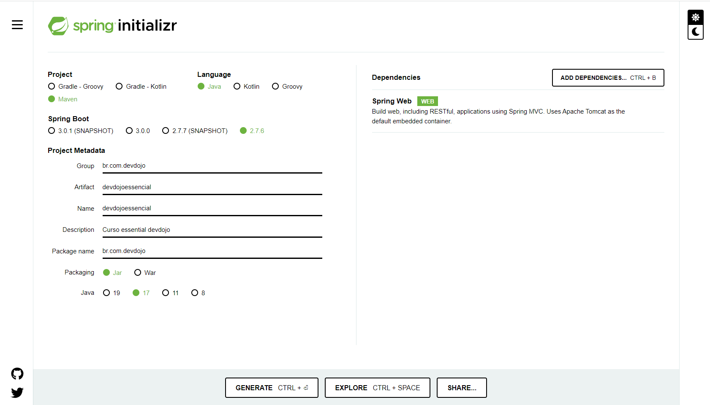
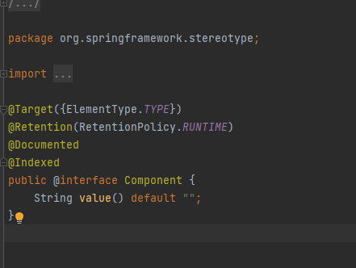
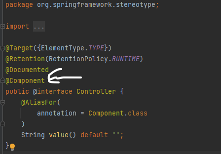
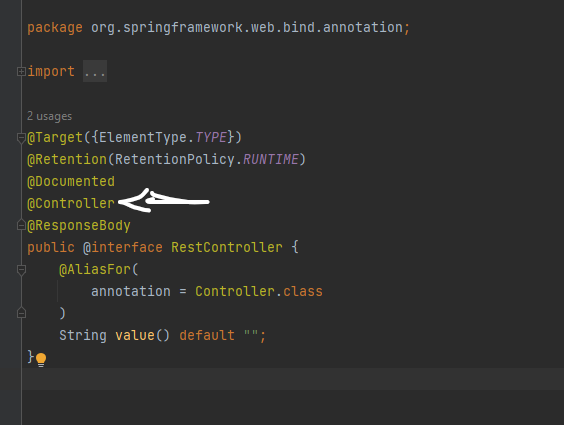
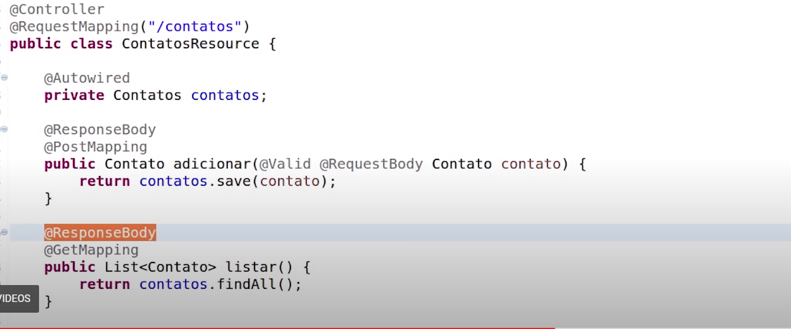

# devdojoessencial

## Projeto com Spring Boot

O Spring Initializr  (https://start.spring.io/ ) -> é uma ferramenta que fornece uma interface web
Podendo gerar seu projeto a partir de uma estrutura de configurações pré-moldadas.

- Group — geralmente o domínio reverso da empresa ou organização. Aqui colocaremos br.com.artigo 
(você pode colocar o que achar melhor)
- Artifact — o artefato a ser gerado (nome da aplicação). Aqui colocaremos livro
- Name — será automaticamente preenchido com o mesmo valor do campo Artifact. Pode ser mudado.
- Description — uma rápida descrição do seu projeto.
- Package name — estrutura do pacote inicial da aplicação
- Packaging — como será empacotada a aplicação, deixaremos o padrão Jar
- Java — versão do java utilizada. 

## Alguns Conceitos

A função do SpringBoot é criar um projeto com pouca configuração.

- O spring Boot -> possui 3 tipos de servlet containers
    - Tomcat
    - Jetty
    - Jboss

No nosso projeto:
- O Tomcat é quem irá manipular as nossas requisições
- Ele utiliza o Jackson para fazer a conversão dos nossos json
- logback para gerenciar os logs assim como o slf4j

JBoss é um servidor de aplicação. Tomcat é um servlet container (o servlet container do JBoss).

O Jetty é um servidor HTTP e Servlet Container 100% escrito em Java. É o grande concorrente do Tomcat e ficou 
famoso por ser utilizado como o servlet container do JBoss.

- servidores de aplicação: softwares, que implementam todas essas especificações Java EE
  Ou seja, quando for preciso utilizar, em uma aplicação, determinadas funcionalidades definidas
  nas especificações Java EE, não é preciso construir essas funcionalidades do inicio.
  Basta apenas colocar a aplicação que esta sendo construída dentro de um servidor de aplicação e
  utilizar todas as funcionalidades que forem necessárias, já implementadas por esse software.
  Em java, o servidor de aplicação mais conhecidos é o Jboss.

- servlets container - Há também, softwares que implementam apenas uma parte das especificações Java EE, não implementando
  todas as especificações,c omo fazem os servidores de aplicação. Por isso, a esses softwares se dão
  o nome de servlets container. Um dos mais utilizados é o Apache Tomcat.

* Jakarta Enterprise Beans(EJB) é uma das várias APIs Java para construção modular de software corporativo.
  EJB é um componente de software do lado do servidor que encapsula a lógica de negócios de um aplicativo

## Maven

O Maven é uma ferramenta desenvolvida pela Apache, ela serve para gerenciar as dependências e automatizar seus builds.

Já o pom.xml é o arquivo de configuração do Maven. Project Object Model (literalmente "projeto modelo de objeto"), 
ou POM, é a peça fundamental de um projeto do Apache Maven. Um POM possui as infomações básicas de um projeto, bem como 
as diretivas de como o artefato final deste projeto deve ser construido. A versão 1.0 do Maven utiliza o arquivo project.

## Os componentes-base do Spring Boot

- Spring Boot Starter:ela baixa diversas libs(bibliotecas) que nós vamos utilizar no nosso projeto.

Sua função principal é combinar as várias dependências advindas de um projeto Spring Boot em uma única dependência,
retirando-se a necessidade de configuração de múltiplas dependências no Maven ou no Gradle.

  <dependency>
  		<groupId>org.springframework.boot</groupId>
  		<artifactId>spring-boot-starter-web</artifactId>
  	</dependency>

Por exemplo: para criar uma aplicação Spring web “convencional”, nós precisaríamos de, pelo menos, as seguintes dependências:

Spring Core; Spring Web; Spring Web MVC; Servlet API;

Adicionalmente, ainda precisaríamos definir e configurar as dependências relativas ao servidor web a ser utilizado, como o Tomcat.

Como deu para notar, esse é um processo bem trabalhoso. Sendo assim, Spring Boot utiliza os inicializadores (starters) 
a fim de diminuí-lo significativamente.

Se estivermos falando de uma aplicação web, por exemplo, estas dependências podem ser resumidas a apenas uma: o spring-boot-starter-web.

- Spring Boot AutoConfigurator

É responsável por gerenciar o processo de configuração de uma aplicação Spring Boot, fornecendo as configurações-padrão 
e fazendo a fusão destas com as possíveis configurações personalizadas.

Por exemplo: se estivermos utilizando o starter para aplicações web, é o Spring Boot AutoConfiguration quem vai fornecer 
as diretivas para resolução de views e resolvers.

Em uma aplicação Spring Boot, o AutoConfigurator pode ser visto através da utilização da tradicional annotation 
@SpringBootApplication, que fica acima do método de inicialização da aplicação.

Internamente, a annotation @SpringBootApplication  é uma combinação das tradicionais annotations @Configuration, 
@ComponentScan e @EnableAutoConfiguration do Spring.

Ex:
@SpringBootApplication
public class DevdojoessencialApplication {

	public static void main(String[] args) {
		SpringApplication.run(DevdojoessencialApplication.class, args);
	}

}

## Spring Boot Actuator

Completando a lista, temos o Spring Boot Actuator, que possui duas funções principais: o provisionamento de endpoints e 
a obtenção de métricas da aplicação.

Por padrão, o Spring Boot AutoConfigurator define que o servidor web deve ser exposto em localhost na porta 8080. 
Quem faz o provisionamento desta configuração no servidor web é o Actuator.
O Actuator é usado principalmente para expor informações operacionais sobre o aplicativo em execução — integridade, métricas, 
informações, dump, env, etc. Ele usa endpoints HTTP ou JMX beans para nos permitir interagir com ele.

Uma vez que esta dependência esteja no caminho de classe, vários terminais estarão disponíveis para nós imediatamente.
Como na maioria dos módulos Spring, podemos configurá-lo ou estendê-lo facilmente de várias maneiras.

## O que é Interface ApplicationContext?

O  ApplicationContext  é a interface central em um aplicativo Spring para fornecer informações de configuração ao aplicativo.

As interfaces BeanFactory e ApplicationContext representam o contêiner Spring IoC. Aqui, BeanFactory é a interface raiz 
para acessar o contêiner Spring. Ele fornece funcionalidades básicas para gerenciar beans.

Por outro lado, o  ApplicationContext  é uma subinterface do  BeanFactory . Portanto, oferece todas as funcionalidades do  
BeanFactory . Além disso, fornece mais funcionalidades específicas da empresa.

Os recursos importantes do ApplicationContext são:

- resolvendo mensagens
- apoiar a internacionalização,
- publicação de eventos
- contextos específicos da camada de aplicativo

É por isso que usamos  ApplicationContext  como o contêiner Spring padrão.

## Classes de Implementação da Interface ApplicationContext

O diagrama abaixo mostra as implementações das interfaces BeanFactory e ApplicationContext :

## Classes que iniciam uma aplicação

Geralmente quando se olha para uma aplicação que inicializa o springboot, você vai ver as anotações

@EnableAutoConfiguration
@ComponentSccan
@Configuration

e as mesmas podem ser substituidas por @SpringBootApplication

##  @SpringBootApplication e @EnableAutoConfiguration no Spring Boot?

Embora @SpringBootApplication e @EnableAutoConfiguration possam ser usados para ativar o recurso de configuração automática 
do Spring Boot, há uma diferença sutil entre eles. O @SpringBootApplication faz muito mais do que o @EnableAutoConfiguration . 
Na verdade, é uma combinação de três anotações:

- @Configuration, que é usada na configuração baseada em Java no framework Spring
- @ComponentScan para habilitar a varredura de componentes que você escreve como  @Controller classes
- @EnableAutoConfgiuration em si, que é usada para permitir auto -configuração no Spring Boo

Os designers do Spring Boot perceberam rapidamente que essas três anotações são frequentemente usadas juntas, então as 
agruparam em @SpringBootApplicaiton . Agora, ao invés de três anotações, você só precisa especificar uma anotação em sua classe Main.

Hoje em dia é comum se referir a uma coleção de endpoints pertencentes a um dado serviço como API, por proximidade e acoplamento; 
em muitos casos o serviço é desenhado e planejado tendo em mente a exposição via endpoints.

Um modelo típico de implementação pode ser interpretado assim:

Onde endpoints são interfaces entre a API e a aplicação consumidora.

## O que é uma API

Uma API (Application Programming Interface - Interface de Programação de Aplicativo)) pode ser definida como um conjunto 
de padrões que permite a construção de aplicativos, onde ele conecta aplicações, podendo ser utilizada nos mais variados 
tipos de negócios.

Com a API você tem uma interface para que um sistema se comunique com outro sistema, compartilhando suas ações e ferramentas. 
A comunicação é feita através de vários códigos, definindo comportamentos específicos.

Além de conectar sistemas, elas têm um papel muito importante na criação de aplicativos porque nos ajudam muito na produtividade.

Para levar as informações de um lado para o outro, geralmente é utilizado o JSON, muito utilizado para retornar os dados das 
APIS baseadas em web. Além disso, esse conceito ocupa pouco espaço e é fácil de transportar via rede.

## Diferença entre Endpoints e APIS

Um endpoint de um web service é a URL onde seu serviço pode ser acessado por uma aplicação cliente.

Endpoint de uma API seria: um endereco utilizado para comunicacao entre uma API e um sistema externo.

Pensando mais "tecnicamente", um endpoint em uma API seria uma URI mapeada. No caso do projeto utilizado no 
curso esses seriam exemplos de endpoints:

GET /topicos
GET /topicos/{id}
POST /topicos
PUT /topicos
DELETE /topicos/{id}

http:\\meusite.com\api\v1\fotos\lista

Uma API é um conjunto de rotinas, protocolos e ferramentas para construir aplicações.

APIs podem existir sem endpoints. Na lista de APIs do windows você pode verificar que a grande maioria trata de conteúdo 
local - como exibir janelas, ou como gerenciar o input de teclado e mouse.

Endpoints também podem existir sem APIs. Imagine uma implementação simples, que retorna apenas a data e hora do servidor; 
a simplicidade da operação não exige a implementação de uma API exclusivamente para isso.

## Diferença entre a anotação @Controller e @RestController no Spring

O Spring Boot é uma estrutura baseada em microsserviços e fazer um aplicativo pronto para produção leva muito pouco tempo.

Existem principalmente dois controladores usados no Spring, o controller e o segundo é RestController com a ajuda de @controller e 
@restcontroller anotações. 

A principal diferença entre @restcontroller e @controller é que o @restcontroller é a combinação da anotação @controller e 
@ResponseBody.O restController adiciona automaticamente o @ResponseBody para todos os seus métodos.

RestController: RestController é usado para criar serviços da Web com a ajuda da anotação @RestController. 
Essa anotação é usada no nível da classe e permite que a classe trate as solicitações feitas pelo cliente. 
 O RestController permite manipular todas as APIs REST, como solicitações GET , POST , Delete, PUT .

@Controller é uma especialização da anotação @Component, ou seja herdou todas as especialidades de @Component

@RestController é uma especialização da anotação @Controller, ou seja herdou todas as especialidades de @Controller

Eu posso desenvolver uma API Rest sem a anotação @RestController? 

Sim pode ser feito ,nós conseguimos criar substituindo pela a anotaão @Controller, com uma diferença básica é que se tivermos uma 
Api Rest, quando fazemos uma chamada para uma ação que temos, e agente vai devolver uma resposta, agente quer que essa resposta
seja serializada para ser jogada na resposta da requisição. Ou seja a resposta do nosso método, da nossa action, por exemplo
uma lista, um objeto agente quer que seja serializado em json, xml ou qualquer outro formato. Para ser jogado na resposta
agente não quer que os dados que estejam na resposta da nossa action, do  método equivalente a nossa Action, não queremos que
ele seja processado juntamente com o template , para que esse template html seja jogado numa resposta. Nós queremos que
os nossos dados sejam serializados, por exemplo json, e jogados na resposta.
E quando estamos utilizando a anotação @Controller para que isso aconteça agente precisa anotar os nossos métodos com a 
anotação @ResponseBody.

Ou seja toda vez que utilizamos na nossa classe a anotação @Controller e quer que nossos dados sejam serializados para serem jogados
diretamente na resposta, agente precisa da Anotação @ResponseBody, e para evitar isso de ter que está usando essa anotação, 
nas nossas APIS REST já que todos os nossos métodos dos nossos controladores agente quer que os dados seja serializados
e jogados na resposta, então foi criado a anotação @RestController que é uma especialização do Controller e possui @ResponseBody
assim agente não precisa mais utilizar em cada método/ação nossa a anotação @ResponseBody.

Se você estiver fazendo uma aplicação numa arquitetura mais tradicional, que você tem suas actions e depois tem seus templates,
que serão processados juntos com seus dados, aí é legal usar @Controller, por que você pode renderizar um template, quanto 
a serialização direta de dados bastando apenas inserir a anotação @ResponseBody.

Se a sua  aplicação é 100% REST que precisa adicionar o @ResponseBody para todos os métodos e não tem a questão do html,
então é melhor utilizar @RestController 

ResponseBody: nada mais é que uma anotação que diz que o seu resultado , você vai ter que fazr uma conversão para json
e vai ter que mandar esse resultado no corpo daquela requisição http, ou seja está querendo retornar apenas um dado json,
uma lista json, simples sem querer trabalhar diretamente com view

## @RequestMapping

Chegamos no endpoint através do @RequestMapping("student). Se quiser acessar o StudentEndpoint terá que fazer atarvés do nome -> student

@RestController//
@RequestMapping("student")
public class StudentEndPoint {

}

Simplificando, a anotação é usada para mapear as solicitações da web para os métodos do Spring Controller.

## @Autowired

AutoWired faz parte do framework de injeção de dependencia do Spring. E será ele que fará a injeção de dependencias e 
intanciar o objeto.

Você pode utilizar essa anotação em:

Propriedades;
Construtores; e
Métodos (mais comumente, os setters)

## O que é injeção de dependências?

Injeção de dependências (ou Dependency Injection – DI) é um tipo de inversão de controle (ou Inversion of Control – IoC) 
que dá nome ao processo de prover instâncias de classes que um objeto precisa para funcionar.

Podemos considerar como pontos de injeção qualquer maneira que possibilite entregar a dependência para um objeto.

- O que torna uma classe elegível de ser injetada
- 
Para que uma instância do tipo ClienteRepositorio possa ser injetada em algum dos pontos de injeção é preciso que ela se torne um bean Spring.

Fazemos isso anotando ela com a anotação @Component ou com qualquer uma de suas especializações:

@Respository
@Service
@Controller

## Entendendo as anotações

@Component :essa anotação diz que a classe pode ser utilizada na injeção de dependencias
@Respository: é uma especialização de Component. Ela deve ser utilizada quando tiver trabalhando com DAO, ele vai fazer com que as exceções
que você não checou, possam ser traduzidas utilizando o Spring Data Acces Exception.
@Service: é uma especialização de Component. Ela é para ser utilizada nas classes que trabalham na camada de Serviços.

## Referencias

- https://vitormoschetti.medium.com/primeiro-projeto-com-spring-boot-9c19c7255aaa
- https://blog.geekhunter.com.br/tudo-o-que-voce-precisa-saber-sobre-o-spring-boot/
- https://www.baeldung.com/spring-boot-actuators
- https://www.javaguides.net/2022/01/what-is-applicationcontext-interface.html
- https://www.java67.com/2018/05/difference-between-springbootapplication-vs-EnableAutoConfiguration-annotations-Spring-Boot.html
- https://cursos.alura.com.br/forum/topico-qual-a-definicao-de-endpoint-170780